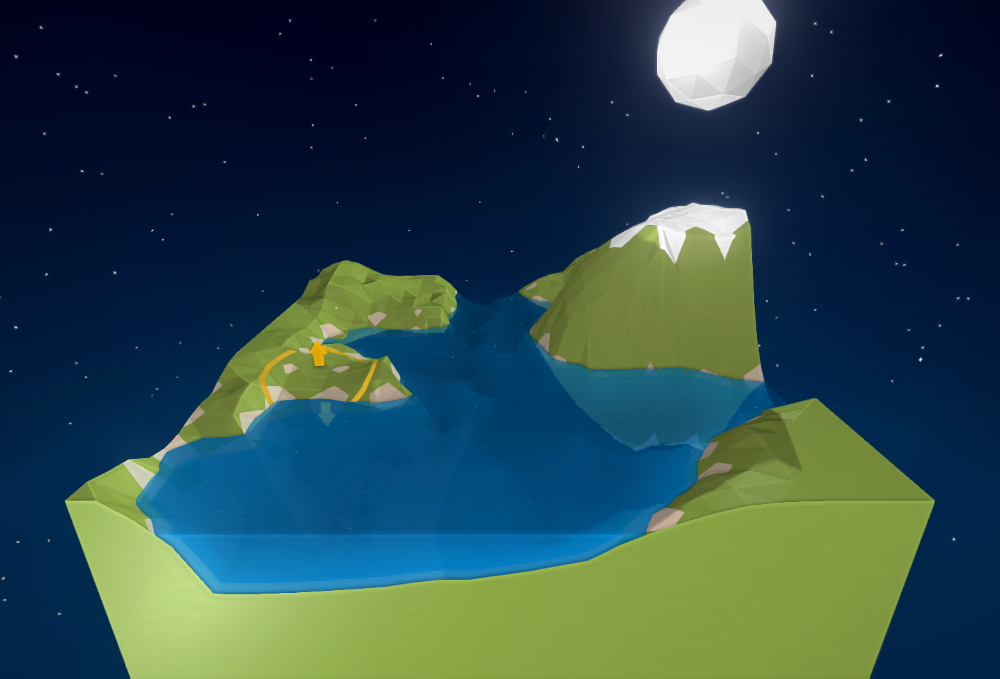
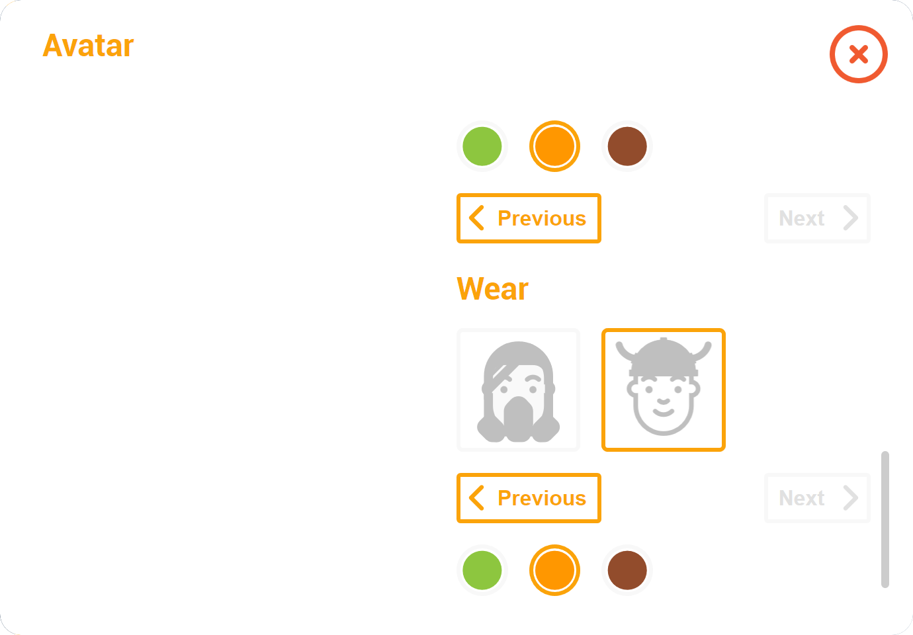
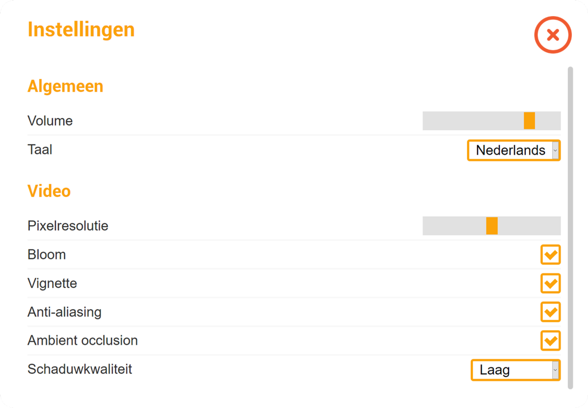
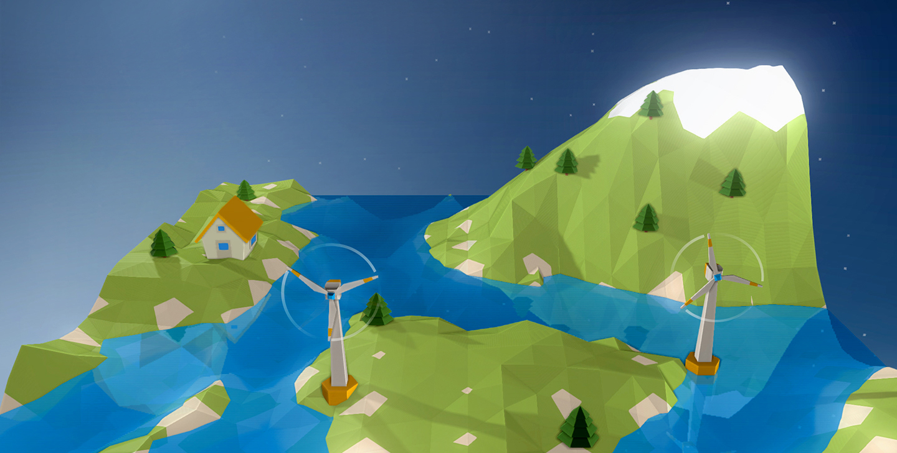

{}

## Buurkracht

Buurkracht is an energy initiative that brings neighborhoods together in order to save energy. I made a low-fidelity prototype that was supposed to encourage children to learn more about the renewables we use and how we can save energy.

The prototype did great, but the teacher did mention it might be too complex and costly to make. This sparked my interest and encouraged me to learn about what turning it into a high-fidelity prototype would entail.

{}

---

  

{}

### Terrain deformation

One of the key features I had demonstrated in my low-fidelity prototype was the ability to deform the terrain and make it your own. These features could theoretically influence which energy sources one should opt for and offer a more diverse playthrough.

A video of the terrain actively being deformed can be seen <a href="https://vimeo.com/260314795" target="_blank">here</a>.

During this process I also learned to write my own shaders.

{}

  

  

    
  

  

    

      
      

        <svg class="ava-edit__face" viewBox="0 0 500 500">
          <path d="M370,215.6v-18.1c0-66.3-53.7-120-120-120s-120,53.7-120,120v18.1c-15.9,0-28.8,12.9-28.8,28.8 c0,15.9,12.9,28.8,28.8,28.8v44.3c0,66.3,53.7,120,120,120s120-53.7,120-120v-44.3c15.9,0,28.8-12.9,28.8-28.8 C398.8,228.5,385.9,215.6,370,215.6z" fill="#DA774A"></path>
          <circle fill="#fff" cx="187.4" cy="240.2" r="25"></circle>
          <circle cx="187.4" cy="240.2" r="12.5"></circle>
          <circle fill="#fff" cx="174.9" cy="240.2" r="7.5"></circle>
          <path class="ava-edit__color" d="M212.400,204.500c-13.800,-13.800,-36.100,-13.800,-49.900,0.000"></path>
          <circle fill="#fff" cx="312.4" cy="240.2" r="25"></circle>
          <circle cx="312.4" cy="240.2" r="12.5"></circle>
          <circle fill="#fff" cx="299.9" cy="240.2" r="7.5"></circle>
          <path class="ava-edit__color" d="M287.600,204.500c13.800,-13.800,36.100,-13.800,49.900,0.000"></path>
          <path class="ava-edit__color" d="M232,288.5c10,9.9,26,9.9,36-0.1"></path>
          <path class="ava-edit__color" d="M213.800,341.000L213.800,341.000c20.000,20.000,52.400,20.000,72.400,0.000"></path>
        </svg>
        <svg class="ava-edit__hair" viewBox="0 0 500 500">
          <path fill="#924C2C" d="M370,281.5L370,281.5l-20,0v36c0,55.1-44.9,100-100,100c-55.1,0-100-44.9-100-100v-36h-20v0h-0.3v36c0,66.3,53.9,120.3,120.3,120.3c66.3,0,120.3-53.9,120.3-120.3v-36H370z"></path>
          <rect fill="#924C2C" x="233" y="35" width="36" height="70"></rect>
          <circle fill="#924C2C" cx="219.4" cy="112.4" r="5"></circle>
          <circle fill="#924C2C" cx="199.4" cy="102.4" r="5"></circle>
          <circle fill="#924C2C" cx="219.4" cy="92.4" r="5"></circle>
          <circle fill="#924C2C" cx="282.6" cy="112.4" r="5"></circle>
          <circle fill="#924C2C" cx="302.6" cy="102.4" r="5"></circle>
          <circle fill="#924C2C" cx="282.6" cy="92.4" r="5"></circle>
        </svg>
        

          <svg class="ava-edit__item--0" viewBox="0 0 500 500"></svg>
          <svg class="ava-edit__item--1" viewBox="0 0 500 500">
            <path fill="#FF9700" d="M130.3,209.8v50.7c0,13.8,11.1,25,24.7,25h48.6c9.4,0,18-5.4,22.2-14l4.3-9c2.3-4.7,7-7.7,12.1-7.7h15.9c5.2,0,9.9,3,12.1,7.7l4.3,9c4.1,8.6,12.7,14,22.2,14h48.6c13.6,0,24.7-11.2,24.7-25v-50.7H130.3z" style="opacity: 0.9;"></path>
            <path d="M283.3,209.8h-9.4v60.3l0.7,1.4c2,4.2,5.1,7.6,8.8,10V209.8z" style="fill: rgb(255, 255, 255); mix-blend-mode: soft-light;"></path>
            <path d="M273.9,209.8h-24v45h8.2c5.2,0,9.9,3,12.1,7.7l3.7,7.6V209.8z" style="fill: rgb(255, 255, 255); opacity: 0.5; mix-blend-mode: soft-light;"></path>
            <path d="M154.9,285.6C154.9,285.6,155,285.6,154.9,285.6l11.1,0v-75.7h-11.1V285.6z" style="fill: rgb(255, 255, 255); opacity: 0.5; mix-blend-mode: soft-light;"></path>
            <path d="M140.2,280.6c4.1,3.1,9.2,5,14.7,5v-75.7h-14.7V280.6z" style="fill: rgb(255, 255, 255); mix-blend-mode: soft-light;"></path>
            <path d="M225.7,209.8h-18.2v75.4c7.8-1.3,14.6-6.3,18.2-13.7l0,0V209.8z" style="fill: rgb(255, 255, 255); opacity: 0.6; mix-blend-mode: soft-light;"></path>
            <path d="M317.3,285.6h27.4c2.4,0,4.4-0.2,7-0.8v-74.9h-34.4V285.6z" style="fill: rgb(255, 255, 255); opacity: 0.8; mix-blend-mode: soft-light;"></path>
          </svg>
          <svg class="ava-edit__item--2" viewBox="0 0 500 500">
            <path fill="#2D2D2D" d="M385.8 206h-38.3c-5.7-4.6-12.8-7-20-7h-26c-7.6 0-14.8 2.6-20.6 7.4h-60.4c-5.8-4.8-13-7.4-20.6-7.4h-25.8c-7.4 0-14.5 2.4-20.2 7h-40v15h26v26c0 8 3 15.3 8.7 21l5.7 5.6c5.2 5.2 12 8 19.3 8h28.8c6.3 0 12.3-2.5 16.8-7l8.6-8.6c4.4-4.5 7-10.5 7-17v-10l5.5-1.8c6.3-2 13-2 19.3 0l7.3 2.4v9.4c0 6.4 2.6 12.4 7 17l8.7 8.5c4.5 4.5 10.5 7 16.8 7h28.8c7.3 0 14.2-2.8 19.3-8l5.7-5.7c5.6-5.6 8.7-13 8.7-21v-26h24v-15zm-166 43c0 2.5-1 4.7-2.6 6.4l-8.6 8.6c-1.7 1.7-4 2.6-6.2 2.6h-28.8c-3.3 0-6.4-1.3-8.7-3.6l-5.8-5.7c-2.8-2.8-4.3-6.4-4.3-10.3v-21l7-7c3.2-3.3 7.7-5.2 12.2-5.2H200c4.6 0 9 2 12.3 5.2l5.4 5.4c1.3 1.3 2 3 2 5V249zm127-2c0 4-1.6 7.6-4.4 10.3l-5.7 5.7c-2.3 2.3-5.4 3.6-8.7 3.6h-28.8c-2.3 0-4.5-1-6.2-2.6l-8.6-8.6c-1.7-1.7-2.6-4-2.6-6.3v-19.7c0-1.8.7-3.6 2-5l5.4-5.3c3.3-3.3 7.6-5 12.3-5l25.8-.2c4.5 0 9 1.8 12.2 5l7 7.2v21z"></path>
          </svg>
          <svg class="ava-edit__item--3" viewBox="0 0 500 500">
            <rect fill="#00AEEF" opacity="0.8" x="155" y="213.5" width="64.8" height="53.2"></rect>
            <rect fill="#ED1C24" opacity="0.8" x="280.2" y="213.5" width="64.8" height="53.2"></rect>
            <path fill="#F3F3F3" d="M385.6,198.5H114.4c-7.5,0-15.5,5.2-15.5,14.9c0,9.7,8,14.9,15.5,14.9v-14.8c0,0,0,0,0,0H140v68.2h94.8l6.3-25.1c0.6-2.2,2.6-3.8,4.9-3.8h4.1h3.2c2.2,0,4.2,1.5,4.8,3.6l7.2,25.2H360v-68.2h25.4c0,0,0.1,0.1,0.1,0.1v14.7c7.5,0,15.5-5.2,15.5-14.9C401.1,203.8,393.1,198.5,385.6,198.5z M219.8,266.7H155v-53.2h9.2h55.6V266.7z M345,266.7h-64.8v-53.2h55.6h9.2V266.7z"></path>
            <path d="M208.7,213.5l-53.2,53.2H155v-28.3l25-25H208.7z" style="fill: rgb(255, 255, 255); mix-blend-mode: soft-light;"></path>
            <path d="M155,219.6l6-6h11.3L155,230.9V219.6z" style="fill: rgb(255, 255, 255); mix-blend-mode: soft-light;"></path>
            <path d="M334.3,213.5l-53.2,53.2h-0.5v-28.3l25-25H334.3z" style="fill: rgb(255, 255, 255); mix-blend-mode: soft-light;"></path>
            <path d="M280.6,219.6l6-6h11.3l-17.3,17.3V219.6z" style="fill: rgb(255, 255, 255); mix-blend-mode: soft-light;"></path>
          </svg>
        

        

          <svg class="ava-edit__wear--0" viewBox="0 0 500 500"></svg>
          <svg class="ava-edit__wear--1" viewBox="0 0 500 500">
            <path fill="#3D88E8" d="M389.2,171.7c-139.2,0-139.2,0-278.3,0c0-76.9,62.3-139.2,139.2-139.2S389.2,94.8,389.2,171.7z"></path>
            <path d="M389.2,171.7c-139.2,0-139.2,0-278.3,0c0-76.9,62.3-139.2,139.2-139.2S389.2,94.8,389.2,171.7z" style="fill: rgb(0, 0, 0); mix-blend-mode: soft-light; opacity: 0.5;"></path>
            <path fill="#3D88E8" d="M396.3,161.7H264.7V25.4c0-1.4-1.1-2.5-2.5-2.5h-24.3c-1.4,0-2.5,1.1-2.5,2.5v136.3H103.8c-1.4,0-2.5,1.1-2.5,2.5v24.3c0,1.4,1.1,2.5,2.5,2.5h292.5c1.4,0,2.5-1.1,2.5-2.5v-24.3C398.8,162.8,397.7,161.7,396.3,161.7z"></path>
            <path d="M124.1,127.9c-1.2-0.1-30.7-2.2-57.2-28.7c-14-14-20.4-28.9-23.2-40.1c-2.4-9.5,4.8-18.7,14.5-18.7h0.3c6.8,0,12.8,4.6,14.5,11.2C74.9,59,79,68.9,88.1,78C106.3,96.3,125.8,98,126,98L124.1,127.9z" style="fill: rgb(244, 226, 193);"></path>
            <path d="M376.3,127.9c1.2-0.1,30.7-2.2,57.2-28.7c14-14,20.4-28.9,23.2-40.1c2.4-9.5-4.8-18.7-14.5-18.7h-0.3c-6.8,0-12.8,4.6-14.5,11.2c-1.9,7.4-6,17.4-15.1,26.5C394,96.3,374.6,98,374.4,98L376.3,127.9z" style="fill: rgb(244, 226, 193);"></path>
            <path fill="#3D88E8" d="M120.4,137.2l-9.7-2.6c-1.3-0.4-2.2-1.7-1.8-3.1c4.2-14.9,10.8-28.9,19.4-41.8c0.8-1.2,2.4-1.4,3.5-0.6l8.2,5.7c1.1,0.8,1.4,2.3,0.6,3.5c-7.7,11.4-13.5,23.9-17.3,37.2C123.1,136.8,121.8,137.5,120.4,137.2z"></path>
            <path fill="#3D88E8" d="M376.5,135.4c-3.8-13.2-9.6-25.7-17.3-37.2c-0.8-1.1-0.5-2.7,0.6-3.5l8.2-5.7c1.1-0.8,2.7-0.5,3.5,0.6c8.7,12.9,15.2,26.9,19.4,41.8c0.4,1.3-0.4,2.7-1.8,3.1l-9.7,2.6C378.3,137.5,376.9,136.8,376.5,135.4z"></path>
          </svg>
          <svg class="ava-edit__wear--2" viewBox="0 0 500 500">
            <path fill="#FF9700" d="M396.3,161.5h-7.5c-3.2-44-26.8-82.3-61.4-105.5v-8.1c0-11.2-9.1-20.3-20.3-20.3c-7.7,0-14.4,4.3-17.8,10.6c-6.2-1.8-12.7-3.2-19.2-4.2c-1.8-9.3-10.1-16.4-19.9-16.4c-9.9,0-18.1,7.1-19.9,16.4c-6.6,1-13.1,2.4-19.4,4.2c-3.4-6.3-10.2-10.7-17.9-10.7c-11.2,0-20.3,9.1-20.3,20.3v8.3c-34.5,23.2-58.1,61.5-61.2,105.4h-7.5c-1.4,0-2.5,1.1-2.5,2.5v24.5c0,1.4,1.1,2.5,2.5,2.5h292.5c1.4,0,2.5-1.1,2.5-2.5V164C398.8,162.6,397.7,161.5,396.3,161.5z"></path>
            <path d="M396.3,161.5h-7.5c-3.2-44-26.8-82.3-61.4-105.5v-8.1c0-11.2-9.1-20.3-20.3-20.3c-7.7,0-14.4,4.3-17.8,10.6c-6.2-1.8-12.7-3.2-19.2-4.2c-1.8-9.3-10.1-16.4-19.9-16.4c-9.9,0-18.1,7.1-19.9,16.4c-6.6,1-13.1,2.4-19.4,4.2c-3.4-6.3-10.2-10.7-17.9-10.7c-11.2,0-20.3,9.1-20.3,20.3v8.3c-34.5,23.2-58.1,61.5-61.2,105.4h-7.5c-1.4,0-2.5,1.1-2.5,2.5v24.5c0,1.4,1.1,2.5,2.5,2.5h292.5c1.4,0,2.5-1.1,2.5-2.5V164C398.8,162.6,397.7,161.5,396.3,161.5z" style="mix-blend-mode: soft-light; opacity: 0.5;"></path>
            <path fill="#FF9700" d="M396.3,161.5H103.8c-1.4,0-2.5,1.1-2.5,2.5v10.2c0-1.4,1.1-2.5,2.5-2.5h292.5c1.4,0,2.5,1.1,2.5,2.5V164C398.8,162.6,397.7,161.5,396.3,161.5z"></path>
            <path fill="#FF9700" d="M250.1,107.1c-11.2,0-20.3-9.1-20.3-20.3V37.8c0-11.2,9.1-20.3,20.3-20.3c11.2,0,20.3,9.1,20.3,20.3v48.9C270.4,98,261.3,107.1,250.1,107.1z M250.1,27.5c-5.7,0-10.3,4.6-10.3,10.3v48.9c0,5.7,4.6,10.3,10.3,10.3s10.3-4.6,10.3-10.3V37.8C260.4,32.1,255.8,27.5,250.1,27.5z"></path>
            <path fill="#FF9700" d="M307.1,107.1c-11.2,0-20.3-9.1-20.3-20.3V47.8c0-11.2,9.1-20.3,20.3-20.3s20.3,9.1,20.3,20.3v38.9C327.5,98,318.3,107.1,307.1,107.1z M307.1,37.5c-5.7,0-10.3,4.6-10.3,10.3v38.9c0,5.7,4.6,10.3,10.3,10.3c5.7,0,10.3-4.6,10.3-10.3V47.8C317.5,42.1,312.8,37.5,307.1,37.5z"></path>
            <path fill="#FF9700" d="M192.9,107.1c-11.2,0-20.3-9.1-20.3-20.3V47.8c0-11.2,9.1-20.3,20.3-20.3s20.3,9.1,20.3,20.3v38.9C213.2,98,204.1,107.1,192.9,107.1z M192.9,37.5c-5.7,0-10.3,4.6-10.3,10.3v38.9c0,5.7,4.6,10.3,10.3,10.3c5.7,0,10.3-4.6,10.3-10.3V47.8C203.2,42.1,198.6,37.5,192.9,37.5z"></path>
          </svg>
        

      

    

  

{}

### Avatar editor

The avatar editor makes heavy use of scalable vector graphics. This made it easy to dynamically add colors and mix objects.

More options can be seen in <a href="https://vimeo.com/259896500" target="_blank">this video</a>.

{}

  

  

{}

### Settings and internationalization

While React made the application easy to reason about due to its componentization, Redux helped state flow throughout the application with ease.

This meant that internationalization became an easy task with the help of `react-intl`.

{}

  

  

    
  

  

    
      

        
    

  

{}

### Result

I learned a lot about Webpack, React, WebGL, Canvas, Node and many other aspects while building out this application. A video of the result can be seen <a href="https://vimeo.com/260311059" target="_blank">here</a>, the repository can be found <a href="https://github.com/imjasonmiller/webgl_prototype" target="_blank">here</a>.

{}

